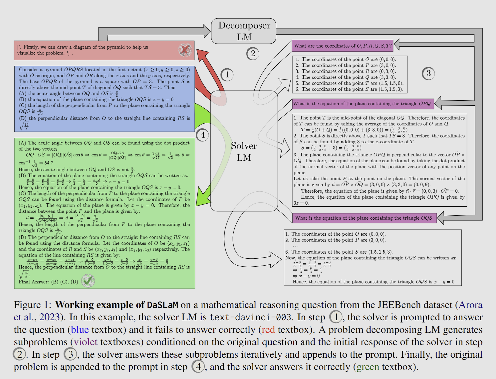

# DaSLaM

This repository contains code for the paper [**Small Language Models Fine-tuned to Coordinate Larger Language Models improve Complex Reasoning**](https://arxiv.org/pdf/2310.18338.pdf), accepted at **EMNLP Main** Conference 2023.


**Authors**: [Gurusha Juneja](https://gurusha01.github.io/), [Subhabrata Dutta](), [Soumen Chakrabarti](), [ Sunny Manchanda](), [Tanmoy Chakraborty](https://www.tanmoychak.com/)

<p align="center">
  
</p>


## 🛠 Dependencies and Installation
- torch `2.0.1+cu117`
- sentencepiece `0.1.99`
- transformers
- trl `0.4.1`
- other dependencies in `requirements.txt`

```python
# git clone this repository
git clone https://github.com/LCS2-IIITD/DaSLaM
cd DaSLaM

# install python dependencies
pip3 install -r requirements.txt
```

## Supervised Finetune Stage
To fine-tune the model for question generation using SFT ru the script,

```python
python3 QuesGenFinetune.py
```

## RL Finetuning Stage
To further finetune the model using RLMF, make the following changes in file ppo_train_13B.py:
```
- line 216: Replace the folder name with the location of the 13B base llama model
- line 223: Replace the folder name with the location of the finetuned adapter
- line 250: Replace the folder name with the location of the 13B llama tokenizer 
- line 263: Replace the folder name with the location of the 13B base llama model
- line 264: Replace the folder name with the location of the 13B instruction finetuned llama adapter
- line 266: Replace the folder name with the location of the 13B llama tokenizer
```

Now run,
```python
python3 LLAMA13B/Context/ppo_train_13B.py
```

## 📞 Contact
If you have any questions or issues, please feel free to reach out [Gurusha Juneja](https://gurusha01.github.io/) at <a href="mailto:gurushajuneja@gmail.com">gurushajuneja@gmail.com</a>.

## ✏️ Citation

If you think that this work is helpful, please feel free to leave a star ⭐️ and cite our paper:

```
@misc{juneja2023small,
      title={Small Language Models Fine-tuned to Coordinate Larger Language Models improve Complex Reasoning}, 
      author={Gurusha Juneja and Subhabrata Dutta and Soumen Chakrabarti and Sunny Manchanda and Tanmoy Chakraborty},
      year={2023},
      eprint={2310.18338},
      archivePrefix={arXiv},
      primaryClass={cs.CL}
}
```


